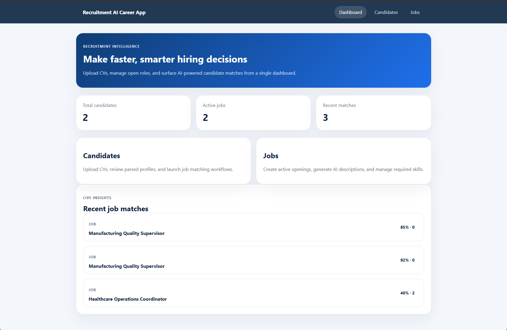

# CareerApp – Recruitment AI Platform

An AI-powered recruitment application that augments the hiring process using Azure AI services. Built with **.NET 10** (backend) and **React TypeScript** (frontend), integrated with **Azure AI Foundry** for intelligent automation.



---

## 🎯 Use Cases

| # | Feature | Description |
|---|---------|-------------|
| 1 | **CV Parsing** | Extract structured data from CVs (PDF/DOCX) using Azure Document Intelligence + Content Understanding with OpenAI fallback |
| 2 | **CV-to-Job Matching** | Score and rank candidates against jobs using GPT-4o (with keyword fallback) – High/Medium/Low match levels |
| 3 | **AI Job Description Generation** | Generate comprehensive job descriptions (About, Responsibilities, Requirements, Preferred Qualifications) via GPT-4o |
| 4 | **Candidate Recommendations** | Surface matching jobs for candidates based on parsed skills, experience, and education |

---

## 🏗️ Architecture

```
┌─────────────────────────────────────────────────────────────────┐
│                        React Frontend                            │
│   Dashboard │ Candidates │ Jobs │ Matching │ CV Upload           │
└──────────────────────────────┬──────────────────────────────────┘
                               │ REST API (HTTP)
┌──────────────────────────────┴──────────────────────────────────┐
│                     .NET 10 Web API                               │
│  CandidatesController │ JobsController │ MatchingController       │
├─────────────────────────────────────────────────────────────────┤
│                    Infrastructure Layer                           │
│  CvParsingService │ JobMatchingService │ JobDescriptionGenerator  │
│  ContentUnderstandingCvParser │ BlobStorageService                │
├─────────────────────────────────────────────────────────────────┤
│                      Azure AI Services                           │
│  Document Intelligence │ Azure OpenAI (GPT-4o) │ Cosmos DB        │
└─────────────────────────────────────────────────────────────────┘
```

---

## 📁 Project Structure

```
CareerApp/
├── src/
│   ├── CareerApp.API/              # ASP.NET Core 10 Web API
│   │   ├── Controllers/            # REST endpoints
│   │   ├── Program.cs              # Service registration & middleware
│   │   ├── Properties/             # launchSettings.json
│   │   └── appsettings.json        # Configuration (do NOT commit secrets)
│   ├── CareerApp.Core/             # Domain layer (models, interfaces)
│   │   ├── Models/                 # Candidate, Job, MatchResult, CvParsingMethod
│   │   ├── Interfaces/             # Service & repository contracts
│   │   └── DTOs/                   # Request/response objects
│   └── CareerApp.Infrastructure/   # Implementation layer
│       ├── Configuration/          # AzureAIOptions, CosmosDbOptions, BlobStorageOptions
│       ├── Data/                   # CosmosDbService
│       ├── Repositories/           # Cosmos DB repositories
│       └── Services/               # AI service integrations
├── client/                         # React TypeScript frontend
│   ├── src/
│   │   ├── components/             # Navbar, FileUpload, MatchScoreBadge, SkillTag
│   │   ├── pages/                  # Dashboard, CandidateDetail, JobDetail, CreateJob, etc.
│   │   ├── services/               # Axios API client
│   │   └── types/                  # TypeScript interfaces
├── docs/
│   └── agent-instructions.md       # AI Foundry agent system prompt
├── CareerApp.slnx                  # .NET solution file
└── .gitignore
```

---

## ☁️ Azure Resources Required

| Resource | Purpose | Required |
|----------|---------|----------|
| **Azure AI Foundry** | GPT-4o for matching, description generation, CV extraction | ✅ |
| **Azure Document Intelligence** | Structured CV parsing (PDF/DOCX) | ✅ |
| **Azure Cosmos DB** | Store candidates, jobs, and match results | ✅ |
| **Azure Blob Storage** | Store uploaded CV files | Optional (local fallback) |
| **Azure Content Understanding** | Alternative CV parsing pipeline | Optional |

### Setup Instructions

1. **Azure AI Foundry** – [ai.azure.com](https://ai.azure.com) → Create project → Deploy `gpt-4o` model
2. **Document Intelligence** – Azure Portal → Create "Document Intelligence" resource (S0 or F0)
3. **Cosmos DB** – Azure Portal → Create "Azure Cosmos DB for NoSQL" → Create database `CareerApp` with containers: `Candidates`, `Jobs`, `MatchResults`

---

## 🚀 Getting Started

### Prerequisites
- [.NET 10 SDK](https://dotnet.microsoft.com/download/dotnet/10.0)
- [Node.js 18+](https://nodejs.org/)
- Azure subscription with resources above

### 1. Clone the repository
```bash
git clone https://github.com/MariemKharrat/CareerApp.git
cd CareerApp
```

### 2. Configure credentials

Edit `src/CareerApp.API/appsettings.json` using the following template:
```json
{
  "CosmosDb": {
    "Endpoint": "https://<your-account>.documents.azure.com:443/",
    "Key": "<your-cosmosdb-key>",
    "DatabaseName": "CareerApp"
  },
  "BlobStorage": {
    "ConnectionString": "DefaultEndpointsProtocol=https;AccountName=<your-account>;AccountKey=<your-key>;EndpointSuffix=core.windows.net",
    "ContainerName": "cv-files"
  },
  "AzureAI": {
    "DocumentIntelligenceEndpoint": "https://<your-resource>.cognitiveservices.azure.com/",
    "DocumentIntelligenceKey": "<your-key>",
    "OpenAIEndpoint": "https://<your-resource>.openai.azure.com/openai/v1",
    "OpenAIKey": "<your-key>",
    "OpenAIDeploymentName": "gpt-4o",
    "ContentUnderstandingEndpoint": "https://<your-resource>.services.ai.azure.com/",
    "ContentUnderstandingKey": "<your-key>",
    "ContentUnderstandingAnalyzerId": "cv-analyzer"
  },
  "Logging": {
    "LogLevel": {
      "Default": "Information"
    }
  },
  "AllowedHosts": "*"
}
```

> ⚠️ **Never commit secrets!** Use User Secrets for local dev:
> ```bash
> cd src/CareerApp.API
> dotnet user-secrets set "AzureAI:OpenAIKey" "<your-key>"
> dotnet user-secrets set "CosmosDb:Key" "<your-key>"
> ```

### 3. Run the backend
```bash
cd src/CareerApp.API
dotnet run
```
The API starts at `http://localhost:5000`.

### 4. Run the frontend
```bash
cd client
npm install
npm start
```
The React app opens at `http://localhost:3000`.

---

## 📡 API Endpoints

### Candidates
| Method | Endpoint | Description |
|--------|----------|-------------|
| POST | `/api/candidates/upload-cv` | Upload CV (PDF/DOCX) → parse & create profile |
| GET | `/api/candidates` | List all candidates |
| GET | `/api/candidates/{id}` | Get candidate details |
| GET | `/api/candidates/{id}/cv` | View/download candidate CV file |
| GET | `/api/candidates/{id}/matches` | Get stored matches for candidate |
| DELETE | `/api/candidates/{id}` | Delete candidate |

### Jobs
| Method | Endpoint | Description |
|--------|----------|-------------|
| GET | `/api/jobs` | List jobs (optional `?active=true/false` filter) |
| GET | `/api/jobs/{id}` | Get job details |
| POST | `/api/jobs` | Create job |
| PUT | `/api/jobs/{id}` | Update job (including activate/close) |
| DELETE | `/api/jobs/{id}` | Delete job |
| POST | `/api/jobs/generate-description` | AI-generate full job description |

### Matching
| Method | Endpoint | Description |
|--------|----------|-------------|
| POST | `/api/matching/candidate/{id}/job/{jobId}` | Match one candidate to one job |
| POST | `/api/matching/candidate/{id}/all-jobs` | Match candidate against all active jobs |
| POST | `/api/matching/job/{id}/all-candidates` | Match job against all candidates |

---

## 🧠 AI Features Detail

### CV Parsing (two methods)
- **Document Intelligence**: Uses Azure prebuilt layout model → extracts text → GPT-4o structures into name, email, skills, experience, education
- **Content Understanding**: Azure Content Understanding pipeline with GPT-4o fallback for extraction

### Job Matching
- **Primary**: GPT-4o evaluates candidate profile against job requirements → returns score (0-100), skill matches, skill gaps, explanation
- **Fallback**: Keyword tokenization with expanded stop words, scoring against RequiredSkills/PreferredSkills

### Job Description Generation
- GPT-4o generates structured descriptions with: About the Role, Key Responsibilities (8-12 bullets), Requirements, Preferred Qualifications
- Uses industry knowledge to fill realistic details based on title, level, and skills provided

---

## 🔒 Security Notes

- **Secrets**: Never commit `appsettings.json` with real keys – use User Secrets or Azure Key Vault
- **CORS**: Configured for `http://localhost:3000` in development
- **Data privacy**: CV data processed within your Azure tenant
- **Local storage**: When Blob Storage is unavailable, CVs are saved locally in `uploads/` directory

---

## 🛣️ Roadmap

- [x] CV parsing with Document Intelligence + OpenAI structured extraction
- [x] GPT-4o powered candidate-job matching
- [x] AI job description generation
- [x] Job status management (Active/Closed)
- [x] PDF viewer in candidate profile
- [x] DOCX file support
- [ ] Azure AD (Entra ID) authentication
- [ ] CI/CD pipeline with GitHub Actions
- [ ] Containerization with Docker
- [ ] Azure App Service deployment
- [ ] Recruiter AI chat assistant (embedded Foundry agent)
- [ ] Batch CV processing
- [ ] Knowledge base RAG for policy-grounded descriptions

---

## 📄 License

Demo project / Mariem Kharrat
